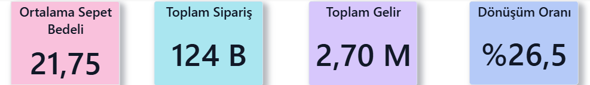
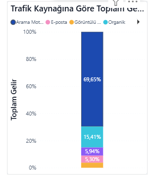
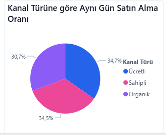
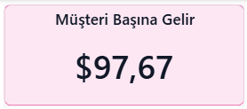
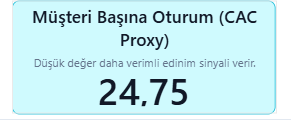
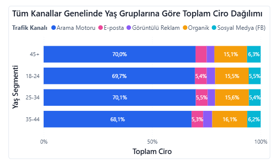

# 📊 Marketing Effectiveness & Channel Analytics (E-commerce)

This project was developed as part of a team during the Workintech Data Analytics Bootcamp.  
The main objective was to analyze marketing performance and identify optimization opportunities using data-driven insights.

---

## 🚀 Project Overview

In this project, we built an end-to-end analytics solution to evaluate marketing channel performance, customer acquisition efficiency, and revenue contribution.

The workflow includes:
- Data extraction and transformation in BigQuery
- Data modeling using dbt (staging & mart layers)
- Dashboard development in Power BI

---

## 🛠️ Tech Stack

- Google BigQuery (Data Warehouse)
- dbt (Data Transformation & Modeling)
- Power BI (Data Visualization)
- SQL

---

## 📌 My Contributions

- Designed and implemented data transformations using dbt  
- Created analytical tables in BigQuery (fact & dimension structure)  
- Built interactive Power BI dashboards  
- Performed marketing analytics (ROI, conversion rate, CAC proxy)  
- Generated actionable business insights  

---

## 📈 Key Metrics

- Revenue  
- Average Order Value (AOV)  
- Conversion Rate  
- Customer Acquisition Cost (Proxy)  
-  Revenue per Customer  
- Sessions per Customer 

---

## ⚠️ ROI Approach

Due to the absence of marketing cost data, ROI could not be calculated directly.

Instead, we used proxy metrics such as:
- Customer Acquisition Cost (CAC proxy)  
- Sessions per customer  
- Revenue per customer  

This approach allowed us to evaluate channel efficiency and identify optimization opportunities.

---

## 📊 Dashboard Preview & Insights

🔹 KPI Overview

🔹 Revenue by Traffic Source

🔹 Same-Day Purchase Rate by Channel Type

🔹 Revenue per Customer

🔹 Customer Acquisition Cost (Proxy)

🔹 Revenue Distribution by Age Group (All Channels)

---

## 📊 Dashboard Scope

The Power BI dashboard includes:

- Revenue analysis by traffic source  
- Customer acquisition analysis by channel  
- Same-day purchase (conversion) rate by channel type  
- Revenue per customer analysis  
- Customer acquisition cost (CAC proxy) analysis  
- Revenue distribution by age group and customer segments 

---

## 💡 Business Impact

- Identified **Search as the primary revenue driver**  
- Highlighted **Organic as a cost-efficient channel**  
- Revealed **optimization opportunities in paid channels**  
- Provided insights for **data-driven marketing strategy decisions**  

---

## ⚠️ Note

This project was developed as part of a team project during a bootcamp.  
All analyses and dashboards were built collaboratively.
